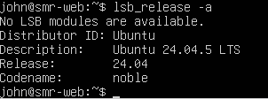
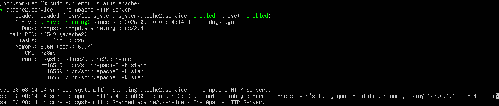
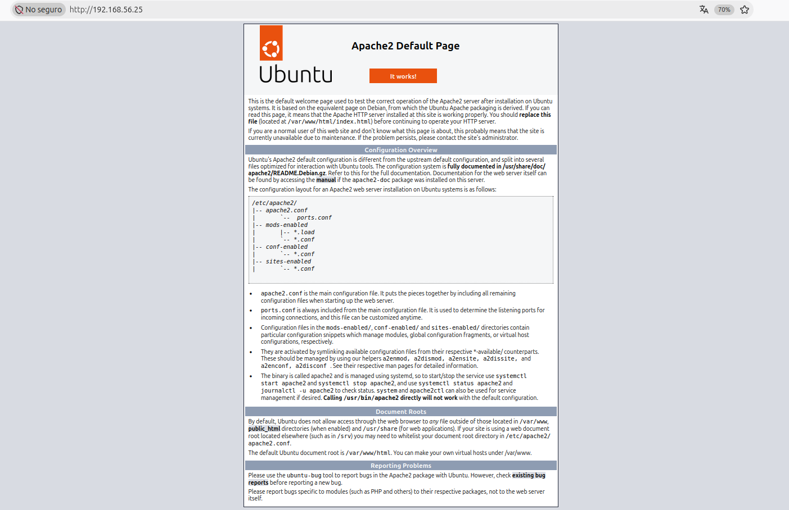
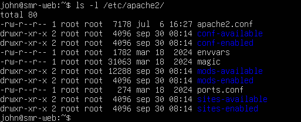
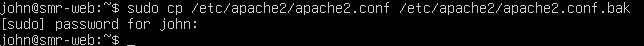
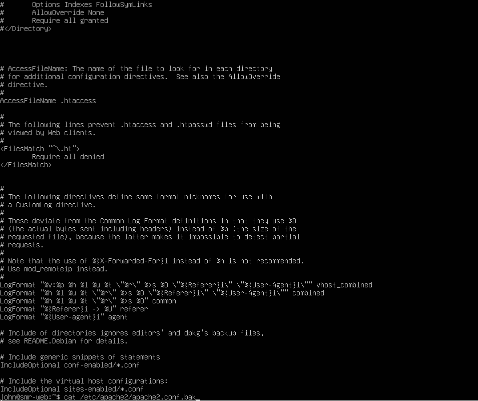

## Apartado 1 ##

### Preparación del sistema ###

Se actualiza primero la lista de paquetes y el sistema:
```bash
sudo apt update
sudo apt upgrade -y
```
Despues se comprueba la version del sistema:
```bash
lsb_release -a
```
*Captura versión de Ubuntu :*



---


## Apartado 2 ##

### Instalación de Apache ###

Ahora se instala Apache:
```bash
sudo apt install apache2 -y
```
Y se comprueba la versión que se ha instalado:
```bash
apache2 -v
```
 #### Pregunta 1: ####
 *¿Qué paquetes adicionales se han instalado como dependencias?*
 
 Se instalaron: 
- apache2-bin
- apache2-data
- apache2-utils
- libapr1
- libaprutil1
- ssl-cert
- mime-support


---

## Apartado 3 ##

### Comprobación del funcionamiento ###

#### 3.1. Se mira el estado del servicio: ####
```bash
sudo systemctl status apache2
```
#### 3.2. Luego los puertos en escucha: ####
```bash
sudo ss -tulpn | grep apache2
```
#### 3.3. Se prueba desde el terminal y desde el navegador: ####
```bash
curl -I http://localhost
```

*Capturas del estado del servicio y de la página por defecto en el navegador:*





#### 3.4. Firewall: ####
```bash
sudo ufw status
sudo ufw allow 'Apache'
```
**Pregunta 2:**

*¿Qué diferencia hay entre los perfiles Apache, Apache Full y Apache Secure?¿Qué diferencia hay entre los perfiles Apache, Apache Full y Apache Secure?*

- **Apache:** Se usa para conexiones HTTP y los datos que viajan no estan protegidos, solo abre el puerto 80.
- **Apache Secure:** Se usa para conexiones seguras HTTPS y los datos que viajan estan protegidos y cifrados, solo abre el puerto 443.
- **Apache Full:** Es la que mas se usa, porque la gente puede entrar de la forma que quieran y el servidor los llevara a la opcion segura, abre el puerto 80 y el 443.

---

## Apartado 4 ##

### Comandos principales de administración ###

Estos son los principales comandos y sus explicaciones:

| Comando | Funcion |
|-----|----|
| sudo systemctl start apache2 | Inicia el servicio |
| sudo systemctl stop apache2 |  Detiene el servicio |
| sudo systemctl restart apache2 | Reinicia (corta conexiones) |
| sudo systemctl reload apache2 | Recarga la configuración sin cortar conexiones |
| sudo systemctl enable apache2 | Arranque automático al iniciar el sistema |
| sudo systemctl disable apache2 | Desactiva el arranque automático |
| apache2ctl configtest | Comprueba la sintaxis de la configuración |
| apache2ctl -S | Muestra los sitios (virtual hosts) cargados |
| apache2ctl -M | Lista los módulos cargados |
| a2enmod / a2dismod | Activa / desactiva módulos |
| a2ensite / a2dissite | Activa / desactiva sitios |
| a2enconf / a2disconf | Activa / desactiva fragmentos de configuración |

**Pregunta 3:**

*¿Cuando conviene usar reload en lugar de restart?*

Cuando por ejemplo se necesita reiniciar pero hay que mantener las conexiones activas.

---

## Apartado 5 ##

### Ficheros y directorios importantes ###

Para ver la estructura de configuracion:
```bash
ls -l /etc/apache2/
```

Estas son las distintas rutas y la descripcion de lo que son:

| Ruta | Descripcion |
|-----|------|
| /etc/apache2/apache2.conf | Fichero de configuración principal |
| /etc/apache2/ports.conf | Puertos en los que escucha Apache |
| /etc/apache2/sites-available/ | Sitios disponibles (definidos, no necesariamente activos) |
| /etc/apache2/sites-enabled/ | Sitios activos (enlaces simbólicos a sites-available) |
| /etc/apache2/mods-available/ y mods-enabled/ | Módulos disponibles y activos |
| /etc/apache2/conf-available/ y conf-enabled/ | Fragmentos de configuración disponibles y activos |
| /etc/apache2/envvars | Variables de entorno (usuario y grupo de ejecución, etc.) |
| /var/www/html/ | Directorio raíz por defecto (DocumentRoot) |
| /var/log/apache2/access.log | Registro de accesos |
| /var/log/apache2/error.log | Registro de errores |

Los ficheros de sites-enabled son enlaces simbolicos y se pueden comprobar con este comando:
```bash
ls -l /etc/apache2/sites-enabled/
```

*Captura del contenido de /etc/apache2/ :*



**Pregunta 3:**

*¿Por qué Apache usa enlaces simbólicos entre los directorios que terminan en las palabras -available y -enabled?*

Usa enlaces simbolicos para evitar que hayan errores, para tenerlo todo bien estructurado y ordenador, y por comodidad 

---

## Apartado 6 ##

### Modificaciones tipicas del servicio ###

Hay que hacer siempre una copia de seguridad antes de modificar un fichero:
```bash
sudo cp /etc/apache2/apache2.conf /etc/apache2/apache2.conf.bak
```

*Captura del comando:*



**Pregunta 4:**

*¿qué contenido tiene el fichero? Explícalo con tus palabras*

Tiene la configuracion importante del servidor web de Apache.


*Captura del contenido del fichero:*



#### 6.1. Cambiar la página de inicio: ####
```bash
echo "<h1>Servidor de TU NOMBRE</h1>" | sudo tee /var/www/html/index.html
```

**Pregunta 5:**

*¿Qué hace esta orden?*

Cambia lo que aparece en la pagina web, entonces aparecera un texto en el que pone **Servidor de john**.


*Captura del contenido del fichero:*


#### 6.2. Cambiar el puerto de escucha *(por ejemplo, al 8080)*: ####
Para cambiar el puerto hay que editar /etc/apache2/ports.conf y el VirtualHost de 000-default.conf:
```bash
sudo nano /etc/apache2/ports.conf
sudo nano /etc/apache2/sites-available/000-default.conf
```
Despues hay que cambiar Listen 80 por Listen 8080 y <VirtualHost *:80> por <VirtualHost *:8080>. Después:
```bash
sudo apache2ctl configtest
sudo systemctl reload apache2
curl -I http://localhost:8080
```
Y cuando se termina se puede dejar de nuevo en el puerto 80.

#### 6.3. Definir el nombre del servidor *(hay que eliminar el aviso "Could not reliably determine the server's fully qualified domain name")*: ####
```bash
echo "ServerName localhost" | sudo tee /etc/apache2/conf-available/servername.conf
sudo a2enconf servername
sudo systemctl reload apache2
```
#### 6.4. Cambiar el correo del administrador *(ServerAdmin en el fichero del sitio)*: ####
#### 6.5. Personalizar una página de error *(por ejemplo, 404)* con la directiva ErrorDocument: ####
